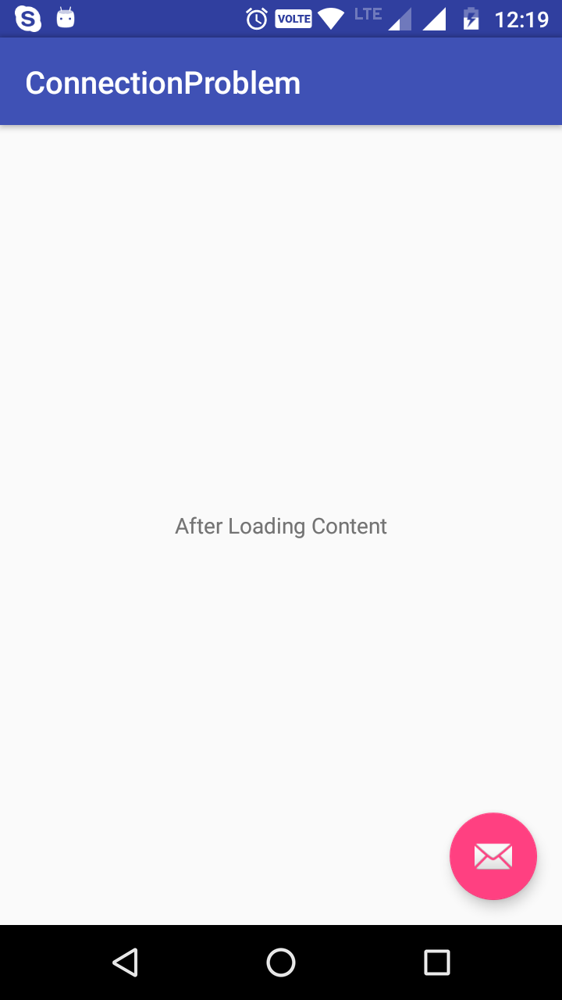
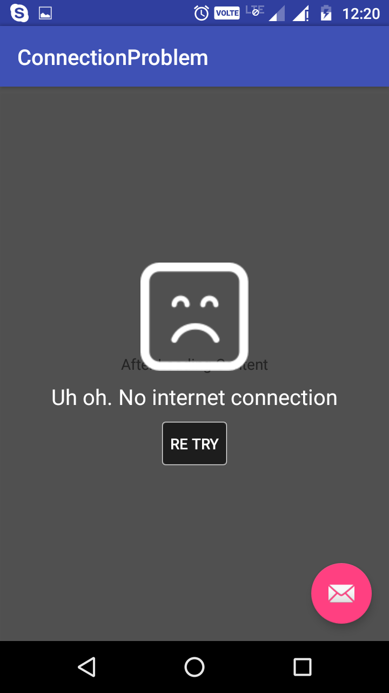

# AutoDetectConnection
This project is helpful for those android users, who want to implement the auto detection of net on their app

Features: 
1) Auto Detection of net (connected/disconnected). 
2) When app has been disconnected to net it will shows the connection problem layout automatically. 
2) Once the app has connected to net it will automatically hide connection problem layout an load the new data.  

1) Connection Loss: 
 

2)Connection Detect: 
 
  

